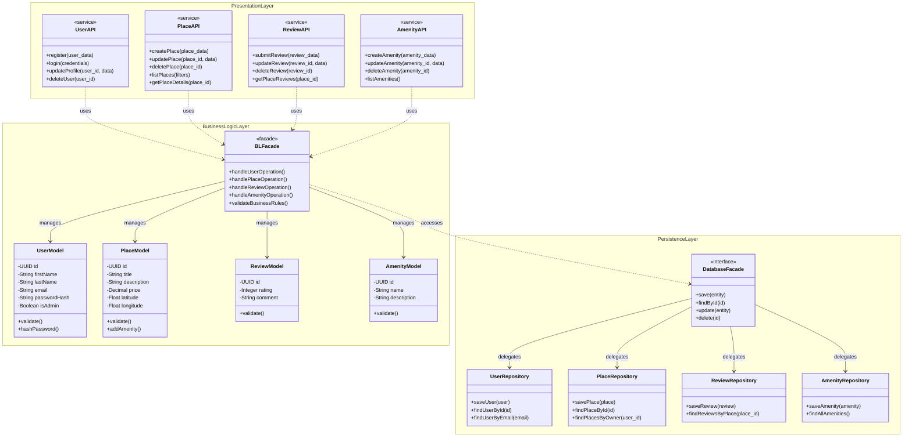
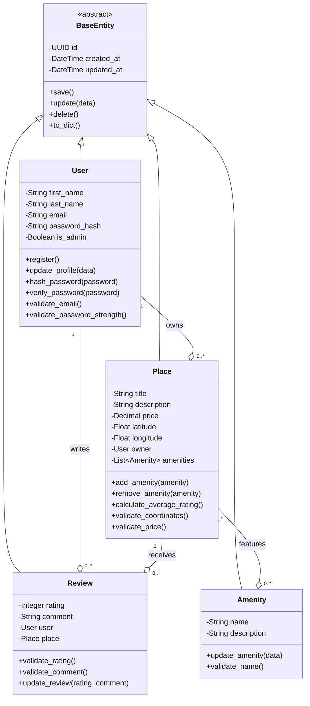
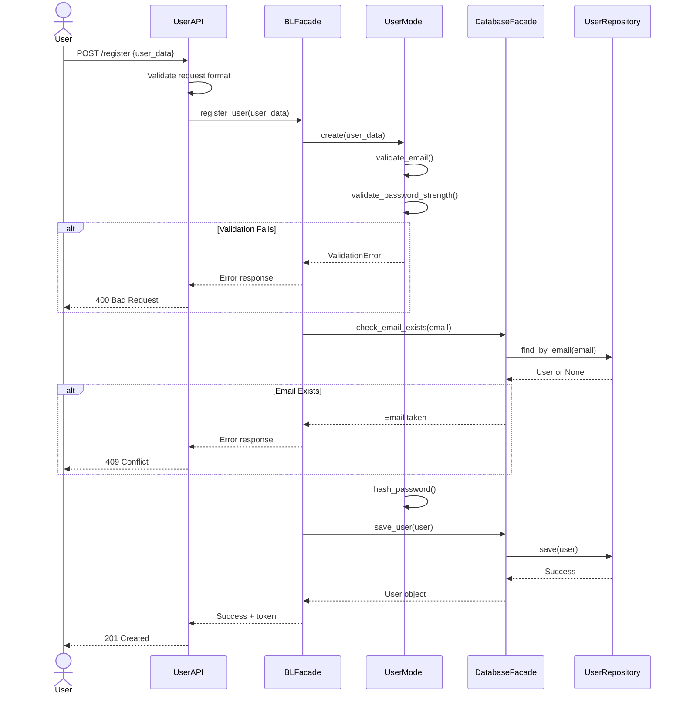
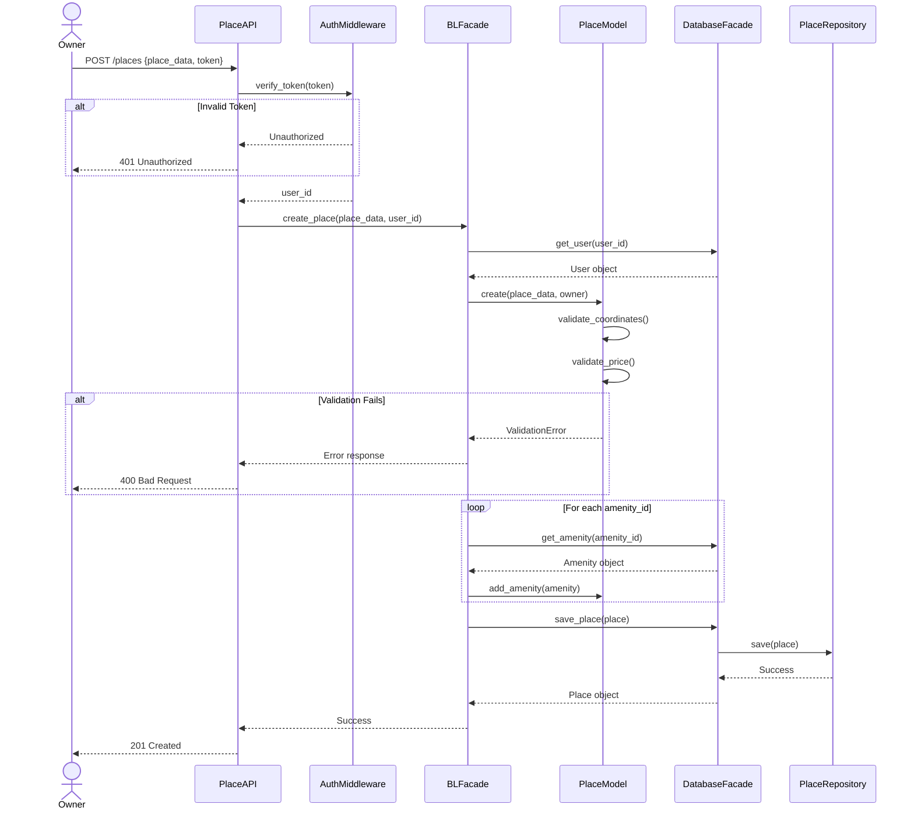
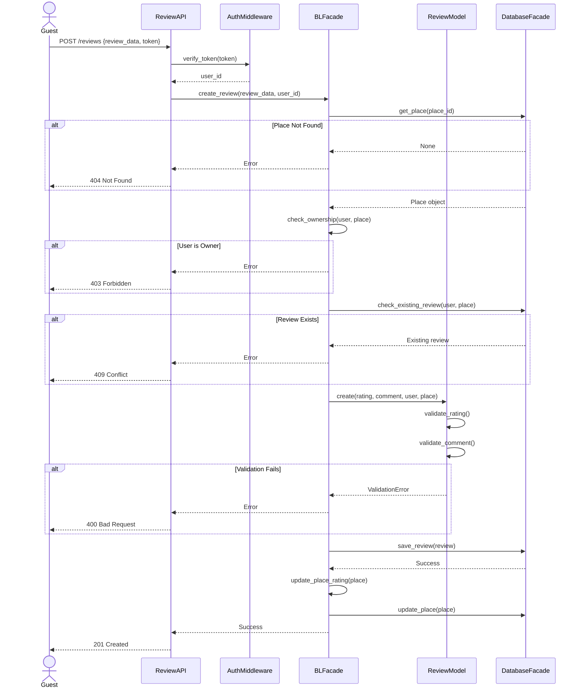
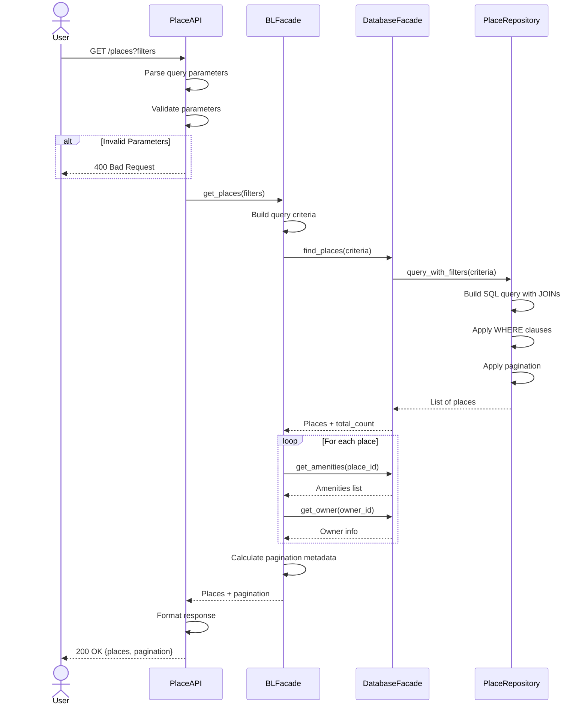

# HBnB Evolution - Technical Documentation

## Project Information
- **Project Name**: HBnB Evolution
- **Version**: 1.0
- **Date**: January 2025
- **Repository**: holbertonschool-hbnb

---

## Table of Contents

1. [Introduction](#introduction)
2. [High-Level Architecture](#high-level-architecture)
3. [Business Logic Layer](#business-logic-layer)
4. [API Interaction Flow](#api-interaction-flow)

---

## Introduction

### Project Overview

HBnB Evolution is a web-based application inspired by AirBnB that enables users to list properties, search for accommodations, and share experiences through reviews. This platform connects property owners with potential guests, creating a marketplace for short-term rentals.

### Purpose of This Document

This technical documentation serves as the comprehensive blueprint for the HBnB Evolution application. It provides detailed specifications for system architecture, business logic design, and API interactions. The document guides developers through the implementation phases and ensures consistent understanding across the development team.

### Document Scope

This document covers:
- **System Architecture**: Three-layer architecture with facade pattern implementation
- **Business Logic Design**: Detailed class structures, attributes, methods, and relationships
- **API Workflows**: Sequence diagrams showing component interactions for key operations
- **Design Rationale**: Explanations of architectural and design decisions

### Primary Operations

The HBnB Evolution application supports four core functionalities:

1. **User Management**: User registration, authentication, profile updates, and role-based access (regular users and administrators)

2. **Place Management**: Property owners can create, update, delete, and list properties with details including title, description, price, geographic coordinates, and amenities

3. **Review Management**: Users can submit, update, and delete reviews for places they've visited, including ratings (1-5 stars) and written feedback

4. **Amenity Management**: System administrators can create and manage amenities (WiFi, parking, pool, etc.) that can be associated with multiple properties

---

## High-Level Architecture

### Architecture Overview

The HBnB Evolution application implements a **three-layer architecture pattern**, which separates the application into three distinct layers, each with specific responsibilities. This architectural approach promotes:

- **Separation of Concerns**: Each layer handles a specific aspect of the application
- **Maintainability**: Changes in one layer have minimal impact on others
- **Scalability**: Layers can be independently scaled based on demand
- **Testability**: Each layer can be tested in isolation

### The Three Layers

**1. Presentation Layer (Services & API)**
- Handles all user interactions through RESTful API endpoints
- Validates incoming HTTP requests
- Formats and returns HTTP responses
- Manages authentication and authorization
- Components: UserAPI, PlaceAPI, ReviewAPI, AmenityAPI

**2. Business Logic Layer (Models)**
- Contains core application logic and business rules
- Defines entity models (User, Place, Review, Amenity)
- Enforces data validation and integrity constraints
- Coordinates operations across multiple entities
- Components: BLFacade, UserModel, PlaceModel, ReviewModel, AmenityModel

**3. Persistence Layer (Database)**
- Manages all data storage and retrieval operations
- Abstracts database-specific implementation details
- Provides repository pattern for data access
- Handles database connections and transactions
- Components: DatabaseFacade, UserRepository, PlaceRepository, ReviewRepository, AmenityRepository

### Facade Pattern Implementation

The **Facade Pattern** provides a simplified, unified interface to complex subsystems. In HBnB Evolution, two facades manage layer communication:

**Business Logic Facade (BLFacade)**
- Acts as a single entry point from the Presentation Layer to Business Logic
- Coordinates operations across multiple models
- Simplifies complex workflows for the API layer
- Centralizes business rule enforcement

**Database Facade (DatabaseFacade)**
- Provides a unified interface for all database operations
- Abstracts database-specific implementation from business logic
- Delegates operations to appropriate repositories
- Manages transactions and connection pooling

### Communication Flow
```
User Request
    ↓
Presentation Layer (API)
    ↓
Business Logic Facade
    ↓
Models (Business Logic)
    ↓
Database Facade
    ↓
Repositories (Persistence)
    ↓
Database
```

**Key Principle**: Each layer only communicates with adjacent layers. The Presentation Layer never directly accesses the Persistence Layer, and vice versa. All communication flows through the facades.

### Package Diagram


### Design Rationale

**Why Three Layers?**
- **Clarity**: Each layer has a clear, distinct purpose
- **Flexibility**: Can modify one layer without affecting others
- **Scalability**: Can scale layers independently (e.g., more API servers, separate database server)
- **Team Collaboration**: Different teams can work on different layers simultaneously

**Why Facade Pattern?**
- **Simplification**: API doesn't need to understand complex model interactions
- **Decoupling**: Changes to business logic don't require API changes
- **Centralization**: Single point for cross-cutting concerns (logging, validation, transactions)
- **Testability**: Easier to mock facades for unit testing

---

## Business Logic Layer

### Overview

The Business Logic Layer is the core of the HBnB Evolution application. It contains all entity models, business rules, and validation logic. This layer is completely independent of the presentation format (web, mobile, CLI) and the persistence mechanism (SQL, NoSQL, file system).

### Class Diagram


### Entity Descriptions

#### BaseEntity (Abstract Class)

**Purpose**: Provides common attributes and methods shared by all entities.

**Attributes**:
- `id` (UUID): Unique identifier for each entity
- `created_at` (DateTime): Timestamp when entity was created
- `updated_at` (DateTime): Timestamp of last modification

**Methods**:
- `save()`: Persists the entity to the database
- `update(data)`: Updates entity attributes
- `delete()`: Removes entity from database
- `to_dict()`: Converts entity to dictionary for API responses

**Design Decision**: Using an abstract base class follows the DRY (Don't Repeat Yourself) principle and ensures all entities have consistent ID and timestamp handling.

#### User Entity

**Purpose**: Represents users of the platform (property owners and guests).

**Key Attributes**:
- `first_name`, `last_name`: User's full name
- `email`: Unique email address for authentication
- `password_hash`: Securely hashed password (never store plain text)
- `is_admin`: Boolean flag for administrative privileges

**Key Methods**:
- `register()`: Creates new user account with validation
- `hash_password(password)`: Hashes password using bcrypt/argon2
- `verify_password(password)`: Validates login credentials
- `validate_email()`: Ensures email format is valid and unique
- `validate_password_strength()`: Enforces password complexity rules

**Business Rules**:
- Email addresses must be unique across all users
- Passwords must be at least 8 characters
- Email format must be valid (contains @, proper domain)

#### Place Entity

**Purpose**: Represents property listings on the platform.

**Key Attributes**:
- `title`: Property name/headline (10-100 characters)
- `description`: Detailed property description (20-1000 characters)
- `price`: Nightly rental price (Decimal for precision)
- `latitude`, `longitude`: Geographic coordinates (Float)
- `owner`: Reference to User who owns the property
- `amenities`: List of associated Amenity objects

**Key Methods**:
- `add_amenity(amenity)`: Associates an amenity with the place
- `remove_amenity(amenity)`: Removes an amenity association
- `calculate_average_rating()`: Computes average from all reviews
- `validate_coordinates()`: Ensures lat/lon are within valid ranges
- `validate_price()`: Ensures price is positive

**Business Rules**:
- Each place must have exactly one owner
- Latitude must be between -90 and +90
- Longitude must be between -180 and +180
- Price must be greater than 0
- Title and description must meet length requirements

#### Review Entity

**Purpose**: Represents user feedback for places.

**Key Attributes**:
- `rating`: Numerical score (1-5 integer)
- `comment`: Written feedback (10-500 characters)
- `user`: Reference to User who wrote the review
- `place`: Reference to Place being reviewed

**Key Methods**:
- `validate_rating()`: Ensures rating is between 1 and 5
- `validate_comment()`: Ensures comment meets length requirements
- `update_review(rating, comment)`: Modifies existing review

**Business Rules**:
- Users cannot review their own places
- Each user can only review a place once
- Rating must be an integer between 1 and 5 (inclusive)
- Comment must be at least 10 characters

#### Amenity Entity

**Purpose**: Represents features/services available at places.

**Key Attributes**:
- `name`: Amenity name (e.g., "WiFi", "Pool", "Parking")
- `description`: Detailed description of the amenity

**Key Methods**:
- `update_amenity(data)`: Updates amenity details
- `validate_name()`: Ensures name is unique and valid

**Business Rules**:
- Amenity names must be unique
- Amenities can be associated with multiple places
- Deleting an amenity removes it from all associated places

### Relationships Explained

#### Inheritance (BaseEntity)

All entities inherit from `BaseEntity`:
- **Notation**: `<|--` (solid line with hollow triangle)
- **Meaning**: "is-a" relationship
- **Benefit**: All entities automatically have `id`, `created_at`, `updated_at`

#### One-to-Many (User → Place)

- **Notation**: `"1" --o "0..*"`
- **Meaning**: One user can own zero or more places
- **Implementation**: Place has `owner` attribute referencing User
- **Cascade**: Deleting a user deletes all their places

#### One-to-Many (User → Review)

- **Notation**: `"1" --o "0..*"`
- **Meaning**: One user can write zero or more reviews
- **Implementation**: Review has `user` attribute referencing User
- **Cascade**: Deleting a user deletes all their reviews

#### One-to-Many (Place → Review)

- **Notation**: `"1" --o "0..*"`
- **Meaning**: One place can have zero or more reviews
- **Implementation**: Review has `place` attribute referencing Place
- **Cascade**: Deleting a place deletes all its reviews

#### Many-to-Many (Place ↔ Amenity)

- **Notation**: `"0..*" --o "0..*"`
- **Meaning**: Places can have multiple amenities, amenities can belong to multiple places
- **Implementation**: Requires join table in database (e.g., `place_amenities`)
- **Example**: WiFi amenity can be associated with thousands of places

### Design Patterns

**Template Method Pattern (BaseEntity)**:
- BaseEntity defines skeleton operations (`save`, `update`, `delete`)
- Subclasses can override behavior while maintaining common structure

**Repository Pattern (Persistence)**:
- Each entity has a corresponding repository for data access
- Separates business logic from data access logic
- Makes it easy to swap database implementations

**Facade Pattern (BLFacade)**:
- Provides simplified interface for complex business operations
- Coordinates multiple models and repositories
- Reduces coupling between presentation and business logic layers

---

## API Interaction Flow

### Overview

This section presents sequence diagrams for four critical API operations. Each diagram illustrates the step-by-step interaction between the Presentation Layer, Business Logic Layer, and Persistence Layer.

### 1. User Registration

**Endpoint**: `POST /api/v1/users/register`

**Purpose**: Create a new user account with email and password.

**Request Body**:
```json
{
  "first_name": "John",
  "last_name": "Doe",
  "email": "john.doe@example.com",
  "password": "SecurePass123!"
}
```

**Sequence Diagram**:


**Flow Explanation**:

1. **User submits registration**: Sends POST request with personal information
2. **API validates format**: Checks that all required fields are present and properly formatted
3. **Business Logic validation**: 
   - Validates email format using regex
   - Validates password strength (minimum 8 characters)
4. **Email uniqueness check**: Queries database to ensure email isn't already registered
5. **Password hashing**: Converts plain text password to secure hash
6. **Persistence**: Saves user to database
7. **Response**: Returns success with authentication token

**Possible Responses**:
- `201 Created`: User successfully registered
- `400 Bad Request`: Invalid email format or weak password
- `409 Conflict`: Email already exists

**Key Components**:
- **UserAPI**: Handles HTTP request/response
- **BLFacade**: Coordinates validation and business rules
- **UserModel**: Performs data validation and password hashing
- **DatabaseFacade**: Abstracts database operations
- **UserRepository**: Executes database queries

### 2. Place Creation

**Endpoint**: `POST /api/v1/places`

**Purpose**: Create a new property listing.

**Request Headers**:
```
Authorization: Bearer {jwt_token}
```

**Request Body**:
```json
{
  "title": "Cozy Beach Apartment",
  "description": "Beautiful 2-bedroom apartment with ocean views",
  "price": 150.00,
  "latitude": 40.7128,
  "longitude": -74.0060,
  "amenity_ids": ["uuid1", "uuid2"]
}
```

**Sequence Diagram**:


**Flow Explanation**:

1. **Authentication**: Verify JWT token and extract user_id
2. **User verification**: Confirm user exists and is active
3. **Place creation**: Create Place model with provided data
4. **Validation**:
   - Coordinates within valid ranges
   - Price is positive
   - Title/description meet length requirements
5. **Amenity association**: For each amenity_id, fetch amenity and associate with place
6. **Persistence**: Save place with all amenities
7. **Response**: Return created place with full details

**Possible Responses**:
- `201 Created`: Place successfully created
- `401 Unauthorized`: Invalid or missing token
- `400 Bad Request`: Invalid coordinates or price
- `404 Not Found`: Amenity not found

**Key Business Rule**: Only authenticated users can create places. The authenticated user automatically becomes the place owner.

### 3. Review Submission

**Endpoint**: `POST /api/v1/reviews`

**Purpose**: Submit a review for a place.

**Request Headers**:
```
Authorization: Bearer {jwt_token}
```

**Request Body**:
```json
{
  "place_id": "place-uuid-123",
  "rating": 5,
  "comment": "Amazing place! Host was very responsive."
}
```

**Sequence Diagram**:


**Flow Explanation**:

1. **Authentication**: Verify user identity
2. **Place verification**: Confirm place exists
3. **Ownership check**: Ensure user is not the place owner (business rule)
4. **Duplicate check**: Ensure user hasn't already reviewed this place
5. **Validation**:
   - Rating is between 1 and 5
   - Comment meets minimum length
6. **Persistence**: Save review
7. **Rating update**: Recalculate place's average rating
8. **Response**: Return created review

**Possible Responses**:
- `201 Created`: Review successfully submitted
- `401 Unauthorized`: Invalid token
- `403 Forbidden`: User is the place owner
- `404 Not Found`: Place doesn't exist
- `409 Conflict`: User already reviewed this place
- `400 Bad Request`: Invalid rating or comment

**Critical Business Rules**:
- Users cannot review their own places
- Each user can only review a place once
- Rating must be 1-5 (inclusive)

### 4. Fetching List of Places

**Endpoint**: `GET /api/v1/places?min_price=50&max_price=200&amenities=wifi`

**Purpose**: Retrieve a filtered list of available places.

**Query Parameters**:
- `min_price`: Minimum nightly price
- `max_price`: Maximum nightly price
- `amenities`: Comma-separated amenity names
- `latitude`, `longitude`, `max_distance`: Location-based filtering
- `page`, `limit`: Pagination

**Sequence Diagram**:


**Flow Explanation**:

1. **Parameter parsing**: Extract and validate query parameters
2. **Criteria building**: Construct filter criteria object
3. **Database query**: Execute complex query with:
   - Price range filtering
   - Amenity filtering (JOIN with amenities table)
   - Location filtering (if coordinates provided)
   - Pagination (LIMIT and OFFSET)
4. **Data enrichment**: For each place, fetch:
   - Associated amenities
   - Owner information
   - Average rating
5. **Pagination metadata**: Calculate total pages, current page, etc.
6. **Response formatting**: Return places with pagination info

**Response Example**:
```json
{
  "places": [
    {
      "id": "uuid",
      "title": "Cozy Beach Apartment",
      "price": 150.00,
      "average_rating": 4.8,
      "amenities": ["WiFi", "Parking"]
    }
  ],
  "pagination": {
    "current_page": 1,
    "total_pages": 5,
    "total_results": 87,
    "per_page": 20
  }
}
```

**Possible Responses**:
- `200 OK`: Places successfully retrieved (may be empty array)
- `400 Bad Request`: Invalid query parameters

**Key Features**:
- No authentication required (public search)
- Supports multiple filter types
- Efficient pagination for large result sets
- Returns enriched data (amenities, owner, ratings)

---

## Conclusion

This technical documentation provides a comprehensive blueprint for the HBnB Evolution application. It establishes:

✅ **Clear Architecture**: Three-layer design with facade pattern  
✅ **Detailed Business Logic**: Complete entity models with attributes and methods  
✅ **Well-Defined Workflows**: Sequence diagrams for key operations  
✅ **Design Rationale**: Explanations for architectural decisions  

### Next Steps

**For Developers:**
1. Review this documentation thoroughly
2. Refer to class diagram when implementing models
3. Follow sequence diagrams for API endpoint implementation
4. Ensure all business rules are enforced

**For Implementation (Part 2 & 3):**
1. Implement BaseEntity and all model classes
2. Create repository classes for persistence
3. Build RESTful API endpoints
4. Implement authentication middleware
5. Create comprehensive test suite

### Document Maintenance

This document should be:
- Updated when requirements change
- Referenced during code reviews
- Used for onboarding new team members
- Kept in sync with implementation

---

**Document Version**: 1.0  
**Last Updated**: January 2025  
**Repository**: holbertonschool-hbnb/part1
