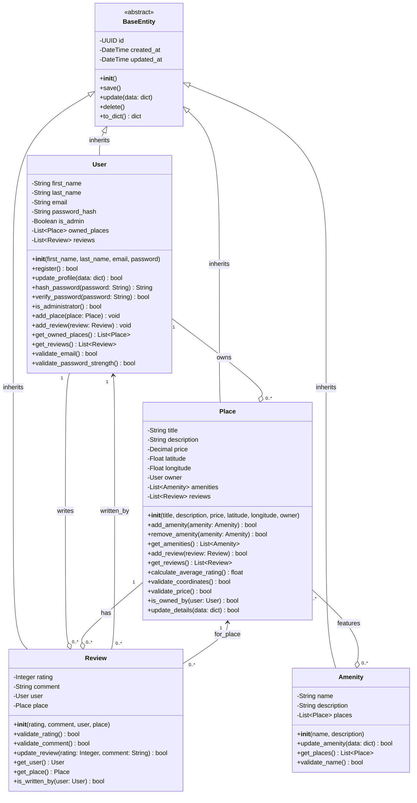

# HBnB Evolution - Business Logic Layer Class Diagram

## Overview
This document presents the detailed class diagram for the Business Logic layer of the HBnB Evolution application. It illustrates the core entities, their attributes, methods, and the relationships between them.

---

## Class Diagram


---

## Entity Descriptions

### 1. BaseEntity (Abstract Class)

**Purpose:**  
BaseEntity serves as the abstract base class for all entities in the Business Logic layer. It provides common attributes and methods that all entities share, promoting code reuse and maintaining consistency across the system.

**Key Attributes:**
- **id** (UUID): Universally unique identifier for each entity instance
  - Type: UUID4 (128-bit identifier)
  - Auto-generated upon entity creation
  - Ensures global uniqueness across the system
  
- **created_at** (DateTime): Timestamp when the entity was first created
  - Automatically set during instantiation
  - Immutable after creation
  - Used for audit trails and data analysis
  
- **updated_at** (DateTime): Timestamp of the last modification
  - Automatically updated on any change
  - Helps track data freshness
  - Essential for synchronization and caching

**Key Methods:**
- **__init__()**: Initializes the entity with a unique ID and timestamps
- **save()**: Persists the entity to the database through the persistence layer
- **update(data: dict)**: Updates entity attributes with provided data and refreshes updated_at
- **delete()**: Removes the entity from the database
- **to_dict()**: Serializes the entity to a dictionary for API responses

**Design Pattern:**  
Uses the **Template Method** pattern, providing a skeleton of common operations that subclasses can extend.

**Why Abstract?**  
BaseEntity is never instantiated directly. It exists solely to provide shared functionality to concrete entities (User, Place, Review, Amenity).

---

### 2. User Entity

**Purpose:**  
Represents individuals who interact with the HBnB platform. Users can be property owners (listing places), guests (leaving reviews), or administrators (managing the platform).

**Attributes:**

- **first_name** (String): User's first name
  - Required field
  - Minimum 1 character, maximum 50 characters
  - Cannot contain special characters (except hyphens, apostrophes)

- **last_name** (String): User's last name
  - Required field
  - Minimum 1 character, maximum 50 characters
  - Cannot contain special characters (except hyphens, apostrophes)

- **email** (String): User's email address
  - Required field
  - Must be unique across all users
  - Must follow valid email format (user@domain.com)
  - Used for authentication and notifications

- **password_hash** (String): Hashed password for authentication
  - Stored as bcrypt/argon2 hash, never plain text
  - Original password never stored or retrievable
  - Minimum 8 characters when set

- **is_admin** (Boolean): Administrator flag
  - Default: False
  - Grants elevated privileges when True
  - Allows access to administrative operations

- **owned_places** (List<Place>): Collection of places owned by this user
  - One-to-many relationship
  - Can be empty if user hasn't listed any properties
  - Automatically updated when places are added/removed

- **reviews** (List<Review>): Collection of reviews written by this user
  - One-to-many relationship
  - Can be empty if user hasn't written reviews
  - Tracked for user reputation and activity

**Methods:**

- **register()**: Creates a new user account
  - Validates all input data
  - Hashes the password
  - Checks for duplicate email
  - Returns success/failure status

- **update_profile(data: dict)**: Updates user information
  - Accepts partial updates (only modified fields)
  - Validates new data before applying changes
  - Cannot change email to an existing user's email
  - Updates the updated_at timestamp

- **hash_password(password: String)**: Securely hashes a password
  - Uses bcrypt or argon2 algorithm
  - Adds salt for additional security
  - Returns the hashed string

- **verify_password(password: String)**: Verifies a login attempt
  - Compares provided password with stored hash
  - Returns True if match, False otherwise
  - Used during authentication

- **is_administrator()**: Checks admin status
  - Returns the is_admin boolean value
  - Used for authorization checks

- **add_place(place: Place)**: Associates a place with this user
  - Adds place to owned_places list
  - Sets this user as the place's owner
  - Used when creating new listings

- **add_review(review: Review)**: Associates a review with this user
  - Adds review to reviews list
  - Sets this user as the review's author

- **get_owned_places()**: Retrieves all places owned by user
  - Returns list of Place objects
  - Useful for "My Listings" functionality

- **get_reviews()**: Retrieves all reviews written by user
  - Returns list of Review objects
  - Useful for user activity history

- **validate_email()**: Validates email format
  - Checks for valid email structure using regex
  - Returns True if valid, False otherwise

- **validate_password_strength()**: Validates password requirements
  - Checks minimum length (8 characters)
  - Can check for complexity requirements (uppercase, numbers, symbols)
  - Returns True if meets requirements

**Business Rules:**
- Email must be unique system-wide
- Password must meet minimum security requirements
- Users can own multiple places
- Users can write multiple reviews
- Users cannot review their own places (enforced at Review level)
- Only admins can delete other users' content

---

### 3. Place Entity

**Purpose:**  
Represents a property listing on the HBnB platform. Places are created by users (owners) and can be reviewed by other users who have stayed there.

**Attributes:**

- **title** (String): Property listing title
  - Required field
  - Minimum 10 characters, maximum 100 characters
  - Should be descriptive and appealing
  - Example: "Cozy Downtown Studio with City Views"

- **description** (String): Detailed property description
  - Required field
  - Minimum 20 characters, maximum 1000 characters
  - Should include amenities, location details, house rules
  - Supports basic formatting

- **price** (Decimal): Nightly rental price
  - Required field
  - Must be positive number
  - Stored with 2 decimal precision (e.g., 99.99)
  - Currency determined by system configuration

- **latitude** (Float): Geographic latitude coordinate
  - Required field
  - Range: -90 to +90 degrees
  - Used for map display and location-based searches
  - Precision: up to 6 decimal places

- **longitude** (Float): Geographic longitude coordinate
  - Required field
  - Range: -180 to +180 degrees
  - Used for map display and location-based searches
  - Precision: up to 6 decimal places

- **owner** (User): User who owns/listed this place
  - Required field
  - Foreign key reference to User
  - Cannot be null
  - Immutable after creation (ownership transfers handled separately)

- **amenities** (List<Amenity>): Features available at this place
  - Many-to-many relationship
  - Can be empty (though not recommended)
  - Examples: WiFi, Parking, Pool, Kitchen

- **reviews** (List<Review>): Reviews written about this place
  - One-to-many relationship
  - Can be empty for new listings
  - Used to calculate average rating

**Methods:**

- **add_amenity(amenity: Amenity)**: Adds an amenity to the place
  - Checks if amenity already exists in list
  - Updates both sides of the relationship
  - Returns True if added, False if already present

- **remove_amenity(amenity: Amenity)**: Removes an amenity
  - Updates both sides of the relationship
  - Returns True if removed, False if not found

- **get_amenities()**: Retrieves all amenities for this place
  - Returns list of Amenity objects
  - Used for displaying place features

- **add_review(review: Review)**: Associates a review with this place
  - Validates that reviewer is not the owner
  - Validates that reviewer hasn't already reviewed this place
  - Adds review to reviews list
  - Returns True if successful

- **get_reviews()**: Retrieves all reviews for this place
  - Returns list of Review objects
  - Ordered by most recent first

- **calculate_average_rating()**: Computes average rating
  - Sums all review ratings
  - Divides by number of reviews
  - Returns 0.0 if no reviews exist
  - Returns float with 1 decimal precision

- **validate_coordinates()**: Validates latitude and longitude
  - Checks latitude is between -90 and +90
  - Checks longitude is between -180 and +180
  - Returns True if valid, False otherwise

- **validate_price()**: Validates price value
  - Checks price is greater than 0
  - Checks price is a valid decimal number
  - Returns True if valid, False otherwise

- **is_owned_by(user: User)**: Checks ownership
  - Compares owner ID with provided user ID
  - Used for authorization checks
  - Returns True if user is owner

- **update_details(data: dict)**: Updates place information
  - Accepts partial updates
  - Validates all new data
  - Cannot change owner
  - Updates updated_at timestamp

**Business Rules:**
- Each place must have exactly one owner
- Coordinates must be valid geographic coordinates
- Price must be positive
- Owners cannot review their own places
- A user can only review a place once
- Title and description must meet minimum length requirements

---

### 4. Review Entity

**Purpose:**  
Represents feedback left by users about places they have visited. Reviews include a numerical rating and written comments, helping other users make informed decisions.

**Attributes:**

- **rating** (Integer): Numerical score for the place
  - Required field
  - Valid range: 1 to 5 (inclusive)
  - 1 = Poor, 5 = Excellent
  - Used to calculate place's average rating

- **comment** (String): Written feedback about the place
  - Required field
  - Minimum 10 characters, maximum 500 characters
  - Should provide constructive feedback
  - Moderated for inappropriate content

- **user** (User): User who wrote this review
  - Required field
  - Foreign key reference to User
  - Cannot be null
  - Immutable after creation

- **place** (Place): Place being reviewed
  - Required field
  - Foreign key reference to Place
  - Cannot be null
  - Immutable after creation

**Methods:**

- **validate_rating()**: Validates the rating value
  - Checks rating is an integer
  - Checks rating is between 1 and 5 (inclusive)
  - Returns True if valid, False otherwise

- **validate_comment()**: Validates the comment text
  - Checks minimum length (10 characters)
  - Checks maximum length (500 characters)
  - Can check for profanity/inappropriate content
  - Returns True if valid, False otherwise

- **update_review(rating: Integer, comment: String)**: Updates review content
  - Allows users to modify their reviews
  - Validates new rating and comment
  - Updates updated_at timestamp
  - Returns True if successful

- **get_user()**: Retrieves the user who wrote the review
  - Returns User object
  - Useful for displaying reviewer information

- **get_place()**: Retrieves the place being reviewed
  - Returns Place object
  - Useful for displaying context

- **is_written_by(user: User)**: Checks authorship
  - Compares review's user ID with provided user ID
  - Used for authorization (only author can edit/delete)
  - Returns True if user is the author

**Business Rules:**
- Each user can only review a place once
- Users cannot review their own places
- Rating must be between 1 and 5
- Comment must meet minimum length requirement
- Reviews can be updated by their author
- Reviews can only be deleted by author or admin
- Deleting a place deletes all its reviews (cascade)
- Deleting a user deletes all their reviews (cascade)

---

### 5. Amenity Entity

**Purpose:**  
Represents features or services available at a place (e.g., WiFi, Parking, Pool, Air Conditioning). Amenities are reusable across multiple places and help users filter and find suitable properties.

**Attributes:**

- **name** (String): Amenity name
  - Required field
  - Must be unique across all amenities
  - Examples: "WiFi", "Free Parking", "Swimming Pool"
  - Minimum 2 characters, maximum 50 characters

- **description** (String): Detailed amenity description
  - Optional field
  - Provides additional context
  - Maximum 200 characters
  - Example: "High-speed fiber internet available throughout the property"

- **places** (List<Place>): Places that offer this amenity
  - Many-to-many relationship
  - Can be empty if newly created
  - Automatically updated when places add/remove amenities

**Methods:**

- **update_amenity(data: dict)**: Updates amenity information
  - Can update name or description
  - Validates uniqueness of new name
  - Updates updated_at timestamp
  - Returns True if successful

- **get_places()**: Retrieves all places with this amenity
  - Returns list of Place objects
  - Useful for "search by amenity" functionality
  - Can be empty list

- **validate_name()**: Validates amenity name
  - Checks minimum length (2 characters)
  - Checks maximum length (50 characters)
  - Checks for uniqueness
  - Returns True if valid

**Business Rules:**
- Amenity names must be unique
- Amenities can be associated with multiple places
- Places can have multiple amenities
- Deleting an amenity removes it from all associated places
- System should provide a predefined list of common amenities
- Users with admin privileges can create new amenities

---

## Relationships Explained

### 1. Inheritance Relationships (Generalization)

**Pattern:** `BaseEntity <|-- User`, `BaseEntity <|-- Place`, etc.

**Explanation:**  
All entity classes inherit from BaseEntity using the "is-a" relationship:
- User **is a** BaseEntity
- Place **is a** BaseEntity
- Review **is a** BaseEntity
- Amenity **is a** BaseEntity

**Benefits:**
- Code reuse: All entities automatically have id, created_at, updated_at
- Polymorphism: Can treat all entities uniformly when needed
- Consistency: All entities follow the same lifecycle methods (save, update, delete)

**UML Notation:** Solid line with closed, hollow arrowhead pointing to parent class

---

### 2. One-to-Many Relationships

#### User to Place (Ownership)
**Pattern:** `User "1" --o "0..*" Place : owns`

**Explanation:**
- **One user** can own **zero or more places**
- Each place belongs to exactly one user
- Cardinality: 1 to many
- Navigation: Bidirectional (User knows its places, Place knows its owner)

**Implementation:**
- User has `owned_places` list
- Place has `owner` reference
- When user is deleted, their places are also deleted (cascade)

**Business Scenario:**
- A user registers and initially owns 0 places
- User creates a listing → owned_places grows
- User can list multiple properties
- Each property has exactly one owner

---

#### User to Review
**Pattern:** `User "1" --o "0..*" Review : writes`

**Explanation:**
- **One user** can write **zero or more reviews**
- Each review is written by exactly one user
- Cardinality: 1 to many
- Navigation: Bidirectional

**Implementation:**
- User has `reviews` list
- Review has `user` reference
- When user is deleted, their reviews are deleted (cascade)

**Business Scenario:**
- New user has written 0 reviews
- User stays at a place → writes a review
- User can write many reviews (one per place)

---

#### Place to Review
**Pattern:** `Place "1" --o "0..*" Review : has`

**Explanation:**
- **One place** can have **zero or more reviews**
- Each review is about exactly one place
- Cardinality: 1 to many
- Navigation: Bidirectional

**Implementation:**
- Place has `reviews` list
- Review has `place` reference
- When place is deleted, all its reviews are deleted (cascade)

**Business Scenario:**
- New listing has 0 reviews
- Guests leave reviews → reviews list grows
- Place can accumulate many reviews over time

---

### 3. Many-to-Many Relationship

#### Place to Amenity
**Pattern:** `Place "0..*" --o "0..*" Amenity : features`

**Explanation:**
- **Many places** can have **many amenities**
- **Many amenities** can belong to **many places**
- Cardinality: Many to many
- Navigation: Bidirectional

**Implementation:**
- Place has `amenities` list
- Amenity has `places` list
- Typically requires a join table in database (PlaceAmenity)
- No cascade delete (removing amenity doesn't delete places)

**Business Scenario:**
- A place can offer: WiFi, Parking, Pool, Kitchen (many amenities)
- WiFi amenity is offered by thousands of places (many places)
- When a place is deleted, amenity still exists for other places
- When an amenity is deleted, it's removed from all places

**Examples:**
```
Place 1 (Beach House) → Amenities: [WiFi, Pool, Beach Access]
Place 2 (City Apartment) → Amenities: [WiFi, Parking, Gym]
Place 3 (Mountain Cabin) → Amenities: [WiFi, Fireplace]

WiFi Amenity → Places: [Place 1, Place 2, Place 3]
Pool Amenity → Places: [Place 1]
Parking Amenity → Places: [Place 2]
```

---

### 4. Association Relationships

#### Review associations
**Pattern:** 
- `Review "0..*" --> "1" User : written_by`
- `Review "0..*" --> "1" Place : for_place`

**Explanation:**  
Reviews create an association between Users and Places:
- A review connects one user to one place
- Acts as a "link" entity in the system
- Represents the user's experience at that specific place

**Business Logic:**
- User A reviews Place X → Creates Review 1
- User B reviews Place X → Creates Review 2
- User A reviews Place Y → Creates Review 3

**Constraint Enforcement:**
- User cannot review the same place twice
- User cannot review their own place
- User must have "stayed" at place (enforced at service level)

---

## UML Notation Reference

### Class Structure
```
+---------------------+
|    ClassName        |
+---------------------+
| -private_attr       |
| +public_attr        |
+---------------------+
| +public_method()    |
| -private_method()   |
+---------------------+
```

### Visibility Modifiers
- `+` Public: Accessible from anywhere
- `-` Private: Accessible only within the class
- `#` Protected: Accessible within class and subclasses

### Relationship Types

| Symbol | Relationship | Meaning |
|--------|-------------|---------|
| `<|--` | Inheritance | "is-a" relationship |
| `*--`  | Composition | Strong ownership (part cannot exist without whole) |
| `o--`  | Aggregation | Weak ownership (part can exist independently) |
| `-->`  | Association | General relationship |
| `..>`  | Dependency | Uses or depends on |

### Multiplicity
- `1` : Exactly one
- `0..1` : Zero or one
- `0..*` : Zero or more
- `1..*` : One or more
- `*` : Many (same as 0..*)

---

## SOLID Principles Application

### Single Responsibility Principle (SRP)
**Each class has one reason to change:**
- User: Manages user account data
- Place: Manages property listing data
- Review: Manages review data
- Amenity: Manages amenity data

Each entity focuses on its own data and behavior without mixing concerns.

### Open/Closed Principle (OCP)
**Classes are open for extension, closed for modification:**
- BaseEntity provides extensible template
- New entity types can inherit from BaseEntity
- Existing entities don't need modification to add new features

### Liskov Substitution Principle (LSP)
**Derived classes can substitute base classes:**
- Any BaseEntity method can work with User, Place, Review, or Amenity
- Polymorphic behavior is preserved
- All subclasses honor BaseEntity contract

### Interface Segregation Principle (ISP)
**Entities only implement methods they need:**
- User has user-specific methods (hash_password, verify_password)
- Place has place-specific methods (add_amenity, calculate_rating)
- No entity is forced to implement unused methods

### Dependency Inversion Principle (DIP)
**Depend on abstractions, not concretions:**
- Entities depend on BaseEntity abstraction
- Business logic doesn't depend on database implementation
- Can swap persistence mechanisms without changing entities

---

## Design Patterns Implemented

### 1. Template Method Pattern (BaseEntity)
Defines skeleton of operations, subclasses fill in details:
```python
class BaseEntity:
    def save(self):
        # Template method
        self.validate()  # Hook for subclasses
        self.persist()   # Common operation
        
class User(BaseEntity):
    def validate(self):
        # User-specific validation
        self.validate_email()
        self.validate_password_strength()
```

### 2. Strategy Pattern (Validation)
Different validation strategies for different entities:
- User: Email validation, password strength
- Place: Coordinate validation, price validation
- Review: Rating range validation
- Amenity: Name uniqueness validation

### 3. Observer Pattern (Potential)
Reviews observe Places:
- When review is added, place's average rating updates
- When review is deleted, place's average rating recalculates

---

## Data Validation Strategy

### Field-Level Validation
Each entity validates its own fields:
```python
# User validation
- email: format check, uniqueness check
- password: strength requirements
- names: character restrictions

# Place validation
- coordinates: range checks
- price: positive number check
- title/description: length requirements

# Review validation
- rating: range check (1-5)
- comment: length requirements

# Amenity validation
- name: uniqueness check, length requirements
```

### Relationship Validation
Business rules enforced at relationship level:
```python
# When creating Review:
- Check user != place.owner (can't review own place)
- Check user hasn't already reviewed this place
- Check rating is valid (1-5)

# When adding Amenity to Place:
- Check amenity isn't already added
- Validate amenity exists
```

### Cascade Operations
Define what happens when entities are deleted:
```python
# Delete User:
- CASCADE: Delete all owned places
- CASCADE: Delete all reviews written by user

# Delete Place:
- CASCADE: Delete all reviews for this place
- NO ACTION: Keep amenities (they're reusable)

# Delete Amenity:
- NO ACTION: Just remove from places' amenity lists
```

---

## Attribute Data Types Explained

### UUID (Universally Unique Identifier)
- **Format**: 128-bit number (e.g., `550e8400-e29b-41d4-a716-446655440000`)
- **Why use UUID**: Guaranteed uniqueness even across distributed systems
- **Generation**: UUID4 (random generation)

### DateTime
- **Format**: ISO 8601 (e.g., `2025-01-25T14:30:00Z`)
- **Timezone**: Store in UTC, convert for display
- **Precision**: Seconds or milliseconds

### String
- **Encoding**: UTF-8
- **Storage**: VARCHAR in database
- **Validation**: Length limits, character restrictions

### Decimal
- **Purpose**: Precise monetary values
- **Precision**: 2 decimal places for prices
- **Why not Float**: Avoids rounding errors in financial calculations

### Float
- **Purpose**: Geographic coordinates
- **Precision**: Up to 6 decimal places (≈11 cm accuracy)
- **Range**: Latitude (-90 to +90), Longitude (-180 to +180)

### Integer
- **Purpose**: Countable values (ratings)
- **Range**: Typically 32-bit signed (-2B to +2B)

### Boolean
- **Values**: True or False
- **Use**: Flags (is_admin, is_active)
- **Storage**: Often as TINYINT(1) in database

---

## Common Operations Flow

### Creating a Place with Amenities
```
1. User creates place
   → Place.__init__(title, description, price, lat, lon, owner)
   → Place.validate_coordinates()
   → Place.validate_price()

2. User adds amenities
   → Place.add_amenity(wifi_amenity)
   → Check if amenity already exists
   → Update place.amenities list
   → Update amenity.places list

3. Save to database
   → Place.save()
   → BaseEntity.save() is called
   → Persistence layer stores data
```

### Submitting a Review
```
1. User submits review
   → Review.__init__(rating, comment, user, place)

2. Validation
   → Review.validate_rating() (1-5 check)
   → Review.validate_comment() (length check)
   → Check user != place.owner
   → Check user hasn't reviewed this place before

3. Association
   → Place.add_review(review)
   → User.add_review(review)

4. Rating update
   → Place.calculate_average_rating()

5. Save to database
   → Review.save()
```

### User Registration
```
1. User provides data
   → User.__init__(first_name, last_name, email, password)

2. Validation
   → User.validate_email() (format check)
   → User.validate_password_strength()
   → Check email uniqueness

3. Security
   → User.hash_password(password)
   → Store hash, discard plain password

4. Save to database
   → User.register()
   → User.save()
```

---

## Future Extensibility

### Potential New Entities
The current design can easily accommodate:

**Booking Entity:**
```python
class Booking(BaseEntity):
    - start_date: DateTime
    - end_date: DateTime
    - user: User
    - place: Place
    - total_price: Decimal
    - status: String (pending/confirmed/cancelled)
```

**Message Entity:**
```python
class Message(BaseEntity):
    - sender: User
    - recipient: User
    - content: String
    - is_read: Boolean
```

**Image Entity:**
```python
class Image(BaseEntity):
    - url: String
    - place: Place
    - is_primary: Boolean
```

### Extending Existing Entities
Can add new attributes without breaking existing code:
- User: `phone_number`, `profile_picture`, `preferred_language`
- Place: `max_guests`, `bedrooms`, `bathrooms`, `house_rules`
- Review: `helpful_count`, `is_verified_stay`

---

## Summary

This detailed class diagram provides:

✅ **Complete entity definitions** with all attributes and methods  
✅ **Clear inheritance hierarchy** from BaseEntity  
✅ **Well-defined relationships** between entities  
✅ **Comprehensive business logic** encapsulation  
✅ **SOLID principles** compliance  
✅ **Extensible design** for future enhancements  
✅ **Proper UML notation** for industry-standard documentation  

The Business Logic layer is now fully specified and ready for implementation in the next phase of the project.
