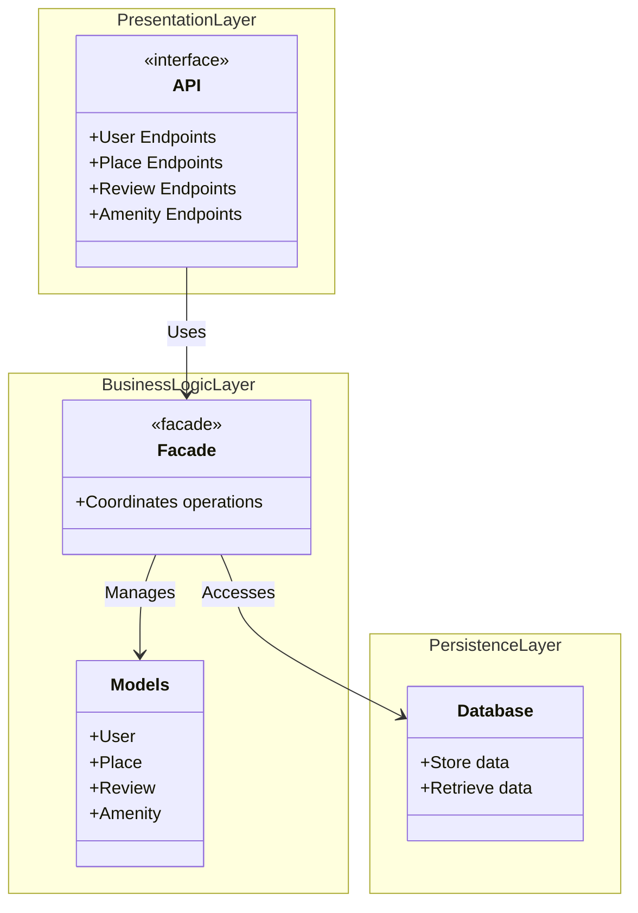

# HBnB Package Diagram

## High-Level Architecture

## Layer Descriptions

### Presentation Layer
- **Purpose**: Handles all user interactions through RESTful APIs
- **Components**: API endpoints for User, Place, Review, and Amenity operations
- **Responsibility**: Input validation, response formatting, HTTP handling

### Business Logic Layer
- **Purpose**: Contains core application logic and business rules
- **Components**: 
  - Facade: Provides unified interface for presentation layer
  - Models: User, Place, Review, Amenity entities
- **Responsibility**: Enforces business rules, coordinates operations, processes data

### Persistence Layer
- **Purpose**: Handles all data storage and retrieval
- **Components**: Database access and management
- **Responsibility**: Database queries, data persistence, transaction management

## Facade Pattern

The Facade acts as an intermediary between the Presentation Layer and the Business Logic/Persistence layers, simplifying the interface and reducing coupling between layers.

**Communication Flow:**
1. Presentation Layer makes request to Facade
2. Facade coordinates with Models (Business Logic)
3. Facade accesses Database (Persistence) when needed
4. Response flows back through Facade to Presentation Layer
