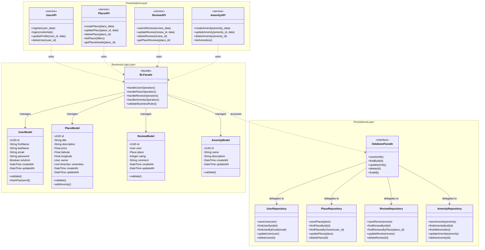

# HBnB Evolution - High-Level Package Diagram

## Overview
This document presents the high-level architecture of the HBnB Evolution application using a three-layer architecture pattern with the Facade design pattern facilitating communication between layers.

---

## Package Diagram


---

## Detailed Layer Descriptions

### 1. Presentation Layer (Services & API)

**Purpose:**  
The Presentation Layer serves as the interface between users and the application. It handles all incoming HTTP requests, validates input data, and formats responses to be sent back to clients.

**Components:**
- **UserAPI**: Manages all user-related endpoints including registration, authentication, profile updates, and account deletion
- **PlaceAPI**: Handles property listing operations such as creating new places, updating existing listings, deleting places, and retrieving place information
- **ReviewAPI**: Processes review submissions, updates, deletions, and retrieval of reviews for specific places
- **AmenityAPI**: Manages amenity-related operations including creation, updates, deletion, and listing all available amenities

**Key Responsibilities:**
- Accept and validate HTTP requests
- Authenticate and authorize users
- Format and return HTTP responses
- Handle errors and return appropriate status codes
- Route requests to the Business Logic Layer via the Facade

**Example Operations:**
- `POST /api/users/register` → `UserAPI.register(user_data)`
- `GET /api/places` → `PlaceAPI.listPlaces(filters)`
- `POST /api/reviews` → `ReviewAPI.submitReview(review_data)`

---

### 2. Business Logic Layer (Models)

**Purpose:**  
The Business Logic Layer contains the core functionality of the application. It enforces business rules, manages data models, and coordinates operations between the Presentation and Persistence layers.

**Components:**

#### BLFacade (Business Logic Facade)
- **Role**: Acts as the single entry point from the Presentation Layer
- **Functions**:
  - Coordinates operations across multiple models
  - Validates business rules before data persistence
  - Simplifies complex operations for the API layer
  - Ensures data integrity and consistency

#### Core Models

**UserModel:**
- Represents user entities in the system
- Stores user information: name, email, password (hashed), admin status
- Includes timestamps for creation and updates
- Methods: `validate()` ensures data correctness, `hashPassword()` secures passwords

**PlaceModel:**
- Represents property listings
- Contains property details: title, description, price, location coordinates
- Maintains relationship with owner (User) and associated amenities
- Methods: `validate()` checks data integrity, `addAmenity()` manages amenity associations

**ReviewModel:**
- Represents user reviews for places
- Links a user to a place with a rating and comment
- Enforces rating constraints (e.g., 1-5 stars)
- Methods: `validate()` ensures rating is within valid range

**AmenityModel:**
- Represents amenities that can be associated with places
- Simple structure with name and description
- Reusable across multiple places (many-to-many relationship)

**Key Responsibilities:**
- Enforce business rules (e.g., users can only review places once)
- Validate data before persistence
- Manage relationships between entities
- Process and transform data
- Implement core application logic

**Business Rules Enforced:**
- Users must have valid email addresses
- Passwords must be hashed before storage
- Places must have valid coordinates (latitude/longitude)
- Reviews must have ratings between 1-5
- Only property owners can update/delete their places

---

### 3. Persistence Layer (Database)

**Purpose:**  
The Persistence Layer handles all data storage and retrieval operations. It abstracts database operations from the business logic, allowing for potential database changes without affecting other layers.

**Components:**

#### DatabaseFacade
- **Role**: Provides a unified interface for all database operations
- **Functions**:
  - Abstracts database-specific operations
  - Delegates to appropriate repositories
  - Manages database connections and transactions
  - Provides common CRUD operations

#### Repositories

**UserRepository:**
- Handles all database operations related to users
- Methods for saving, finding (by ID or email), updating, and deleting users
- Manages user-specific queries

**PlaceRepository:**
- Manages place data persistence
- Supports finding places by owner, location, or other criteria
- Handles complex queries involving amenities

**ReviewRepository:**
- Persists review data
- Enables retrieval of reviews by place or user
- Manages review update and deletion operations

**AmenityRepository:**
- Stores and retrieves amenity information
- Provides listing of all available amenities
- Manages amenity lifecycle operations

**Key Responsibilities:**
- Execute SQL queries or ORM operations
- Manage database connections
- Handle transactions
- Ensure data persistence
- Provide data retrieval methods
- Handle database errors

**Data Operations:**
- **Create**: Insert new records into database
- **Read**: Query and retrieve data
- **Update**: Modify existing records
- **Delete**: Remove records from database

---

## Facade Pattern Implementation

### What is the Facade Pattern?

The Facade Pattern provides a simplified, unified interface to a complex subsystem. In the HBnB application, it acts as an intermediary that reduces coupling between layers and simplifies communication.

### Facade Components in HBnB

#### 1. Business Logic Facade (BLFacade)

**Location**: Between Presentation and Business Logic layers

**Purpose**:
- Provides a single point of entry for all API requests
- Coordinates operations across multiple models
- Simplifies complex business logic operations
- Hides internal complexity from the Presentation Layer

**Example Flow**:
```
UserAPI.register(user_data)
    ↓
BLFacade.handleUserOperation("register", user_data)
    ↓
- Validates user data using UserModel.validate()
- Checks for duplicate emails
- Hashes password using UserModel.hashPassword()
- Coordinates with DatabaseFacade to persist user
    ↓
Returns success/failure to UserAPI
```

**Benefits**:
- API doesn't need to know about internal model interactions
- Business rules are centralized
- Easier to modify business logic without changing API

#### 2. Database Facade (DatabaseFacade)

**Location**: Between Business Logic and Persistence layers

**Purpose**:
- Abstracts database operations
- Provides consistent interface regardless of database type
- Delegates to specialized repositories
- Manages database connections and transactions

**Example Flow**:
```
BLFacade.handlePlaceOperation("create", place_data)
    ↓
DatabaseFacade.save(place)
    ↓
DatabaseFacade.delegates to PlaceRepository
    ↓
PlaceRepository.savePlace(place)
    ↓
Database INSERT operation
```

**Benefits**:
- Business logic doesn't depend on specific database implementation
- Can switch databases (SQL to NoSQL) without changing business logic
- Centralized error handling for database operations

### Communication Flow Example: Creating a Review

Here's how the layers interact when a user submits a review:
```
1. USER submits review via HTTP POST
   ↓
2. PRESENTATION LAYER: ReviewAPI.submitReview(review_data)
   - Validates HTTP request format
   - Extracts review data
   ↓
3. BUSINESS LOGIC LAYER: BLFacade.handleReviewOperation("create", review_data)
   - Creates ReviewModel instance
   - Calls ReviewModel.validate()
   - Checks business rules:
     * User has visited the place
     * User hasn't already reviewed this place
     * Rating is between 1-5
   ↓
4. PERSISTENCE LAYER: DatabaseFacade.save(review)
   - DatabaseFacade delegates to ReviewRepository
   - ReviewRepository.saveReview(review)
   - Database INSERT operation
   ↓
5. RESPONSE flows back through layers:
   DatabaseFacade → BLFacade → ReviewAPI → HTTP Response to USER
```

### Why Use Facades?

**Advantages:**
1. **Reduced Complexity**: Each layer only sees a simple interface
2. **Loose Coupling**: Layers don't depend on internal details of other layers
3. **Flexibility**: Can change implementation without affecting other layers
4. **Centralized Control**: Single point for managing operations
5. **Easier Testing**: Can mock facades for unit testing
6. **Clear Boundaries**: Enforces architectural separation

**Without Facades:**
- API would need to know about all models and their interactions
- Business logic would need database connection details
- Changes in one layer would ripple through all layers
- Code would be tightly coupled and hard to maintain

---

## Architecture Benefits

### Separation of Concerns
Each layer has a distinct responsibility:
- **Presentation**: User interaction
- **Business Logic**: Application rules and processing
- **Persistence**: Data storage

### Maintainability
- Changes in one layer minimally impact others
- Easy to locate and fix bugs
- Clear organization of code

### Scalability
- Layers can be scaled independently
- Can distribute layers across different servers
- Easier to optimize performance at each layer

### Testability
- Each layer can be tested in isolation
- Mock facades for unit testing
- Integration testing at layer boundaries

### Reusability
- Business logic can be used by different presentation interfaces (web, mobile, CLI)
- Models can be reused across different operations
- Repositories provide reusable data access patterns

---

## Design Decisions

### Why Three Layers?
- **Industry Standard**: Proven pattern used in enterprise applications
- **Clear Boundaries**: Each layer has specific, well-defined responsibilities
- **Flexibility**: Easy to modify or replace individual layers
- **Team Collaboration**: Different teams can work on different layers

### Why Facade Pattern?
- **Simplification**: Reduces complexity of inter-layer communication
- **Decoupling**: Layers don't need to know internal details of other layers
- **Single Entry Point**: Makes it easier to add cross-cutting concerns (logging, authentication)
- **Future-Proofing**: Easier to refactor or add new features

### Communication Direction
- **Top-Down**: Requests flow from Presentation → Business Logic → Persistence
- **Bottom-Up**: Responses flow from Persistence → Business Logic → Presentation
- **No Skipping**: Presentation never directly accesses Persistence (enforced by facades)

---

## Future Considerations

### Potential Enhancements
1. **Caching Layer**: Add between Business Logic and Persistence for performance
2. **Message Queue**: For asynchronous operations (email notifications, image processing)
3. **API Gateway**: For handling authentication, rate limiting at presentation layer
4. **Service Layer**: Split Business Logic into separate microservices as application grows

### Database Implementation (Part 3)
The DatabaseFacade and Repositories are currently interfaces. In Part 3, these will be implemented with:
- Specific database technology (PostgreSQL, MySQL, MongoDB)
- ORM framework (SQLAlchemy, Django ORM)
- Connection pooling
- Transaction management
- Query optimization

---

## Summary

This high-level package diagram establishes the architectural foundation for the HBnB Evolution application. The three-layer architecture with facade pattern provides:

✅ Clear separation of concerns  
✅ Scalable and maintainable structure  
✅ Flexibility for future changes  
✅ Testable and modular design  
✅ Industry-standard best practices  

The architecture ensures that as the application grows, it remains organized, maintainable, and easy to understand for all developers working on the project.
