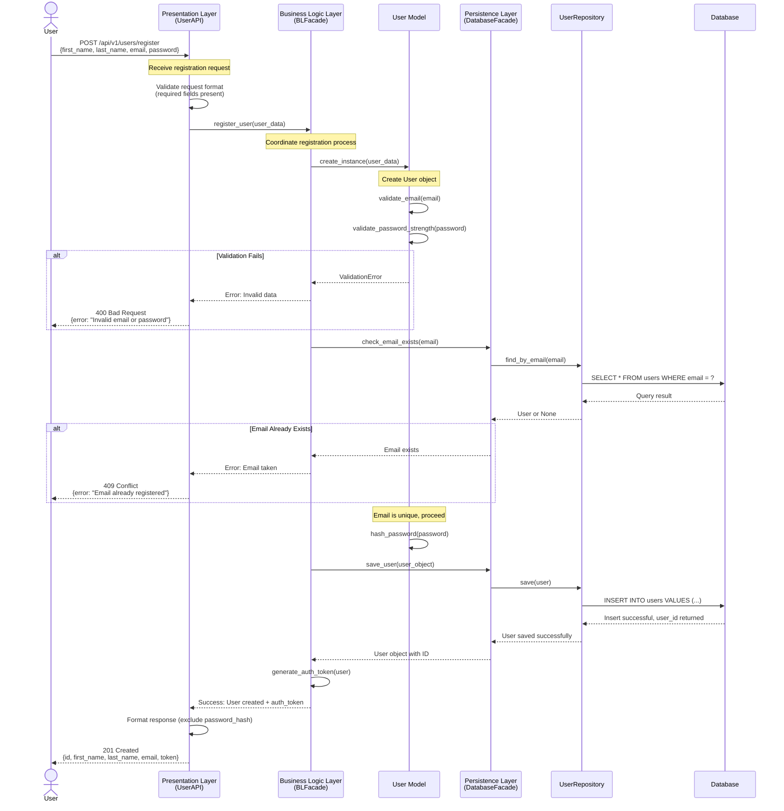
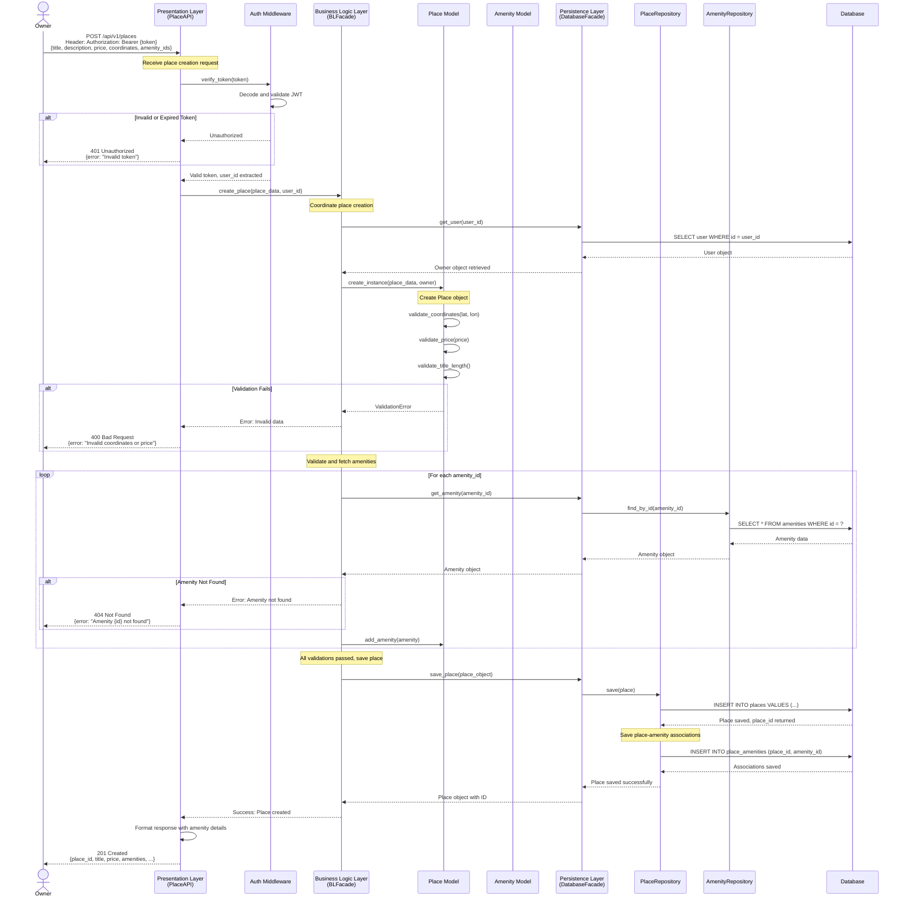
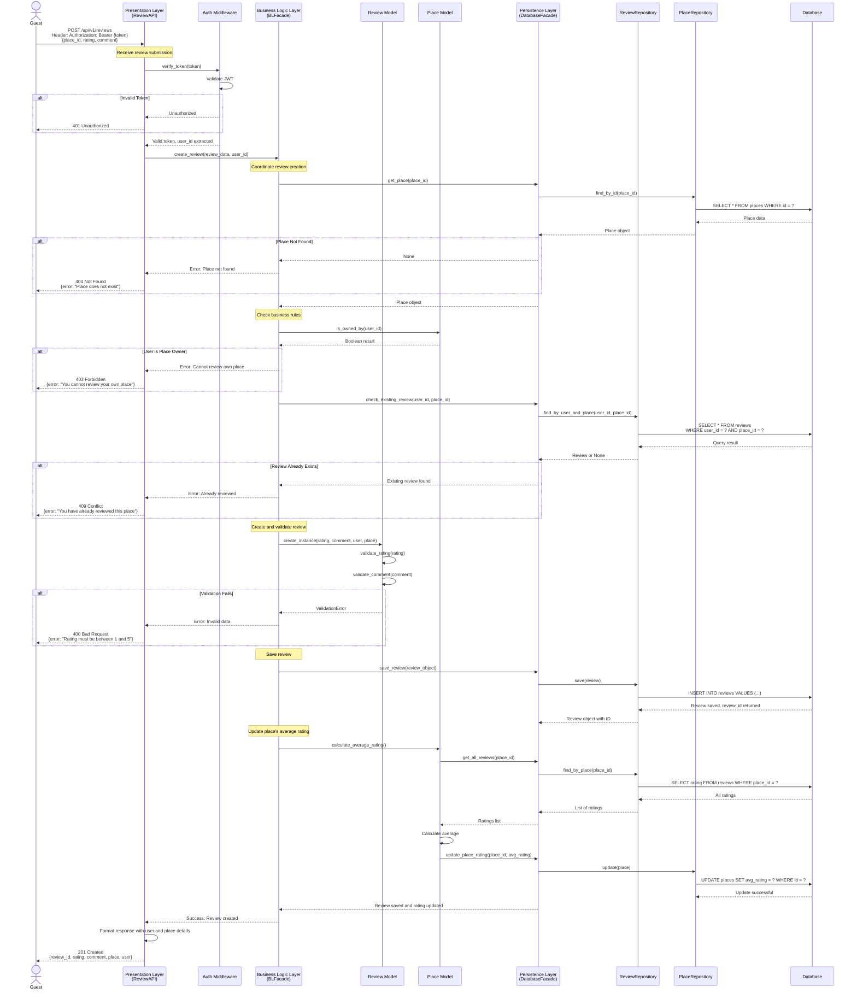
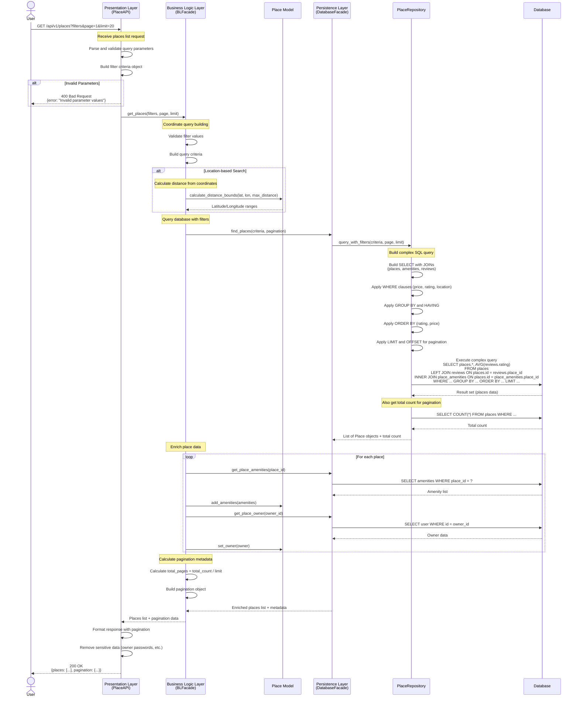

# HBnB Evolution - API Sequence Diagrams

## Overview
This document presents sequence diagrams for four critical API operations in the HBnB Evolution application. Each diagram illustrates the step-by-step interaction between the Presentation Layer (API), Business Logic Layer (Models & Facade), and Persistence Layer (Database) to fulfill user requests.

---

## 1. User Registration

### Use Case Description
A new user creates an account on the HBnB platform by providing their personal information (first name, last name, email, and password). The system validates the data, ensures the email is unique, securely hashes the password, and stores the user information in the database.

### API Endpoint
```
POST /api/v1/users/register
```

### Request Body
```json
{
  "first_name": "John",
  "last_name": "Doe",
  "email": "john.doe@example.com",
  "password": "SecurePass123!"
}
```

### Sequence Diagram


### Step-by-Step Flow

1. **User Submits Registration Request**
   - User sends POST request with personal information
   - Data includes: first_name, last_name, email, password

2. **Presentation Layer Validation**
   - UserAPI receives the request
   - Validates request format (all required fields present, proper JSON)
   - Checks basic structure before passing to business logic

3. **Business Logic Processing**
   - BLFacade coordinates the registration process
   - Creates a User model instance with provided data
   - User model validates email format (regex check)
   - User model validates password strength (min 8 chars, complexity)

4. **Email Uniqueness Check**
   - BLFacade requests email existence check from DatabaseFacade
   - DatabaseFacade delegates to UserRepository
   - UserRepository queries database for existing email
   - If email exists: returns 409 Conflict error
   - If email is unique: proceeds to next step

5. **Password Security**
   - User model hashes the password using bcrypt/argon2
   - Original password is discarded, only hash is kept
   - Hash is irreversible for security

6. **Data Persistence**
   - BLFacade requests user save operation
   - DatabaseFacade delegates to UserRepository
   - UserRepository executes INSERT SQL statement
   - Database confirms successful insertion and returns generated user ID
   - User object is updated with the ID

7. **Response Generation**
   - BLFacade generates authentication token for the new user
   - Returns success confirmation to API layer
   - API formats response (removes sensitive data like password_hash)
   - Returns 201 Created with user details and authentication token

### Success Response (201 Created)
```json
{
  "id": "550e8400-e29b-41d4-a716-446655440000",
  "first_name": "John",
  "last_name": "Doe",
  "email": "john.doe@example.com",
  "created_at": "2025-01-25T14:30:00Z",
  "token": "eyJhbGciOiJIUzI1NiIsInR5cCI6IkpXVCJ9..."
}
```

### Possible Error Responses

**400 Bad Request** - Invalid data format
```json
{
  "error": "Invalid email format"
}
```

**409 Conflict** - Email already exists
```json
{
  "error": "Email already registered"
}
```

---

## 2. Place Creation

### Use Case Description
An authenticated user (property owner) creates a new property listing by providing details such as title, description, price, location coordinates, and amenities. The system validates the data, associates the place with the owner, links selected amenities, and stores the place in the database.

### API Endpoint
```
POST /api/v1/places
```

### Request Headers
```
Authorization: Bearer {token}
```

### Request Body
```json
{
  "title": "Cozy Beachfront Apartment",
  "description": "Beautiful 2-bedroom apartment with ocean views",
  "price": 150.00,
  "latitude": 40.7128,
  "longitude": -74.0060,
  "amenity_ids": ["amenity-uuid-1", "amenity-uuid-2"]
}
```

### Sequence Diagram


### Step-by-Step Flow

1. **Owner Submits Place Creation Request**
   - Authenticated user sends POST request with place details
   - Includes authorization token in header
   - Provides title, description, price, coordinates, and amenity IDs

2. **Authentication**
   - API layer extracts token from Authorization header
   - AuthMiddleware verifies token validity
   - Decodes JWT to extract user_id
   - If token is invalid/expired: returns 401 Unauthorized
   - If valid: proceeds with user_id

3. **User Verification**
   - BLFacade retrieves user object using user_id
   - Confirms user exists and is active
   - This user becomes the place owner

4. **Place Model Creation**
   - Creates Place model instance with provided data
   - Associates owner (User object) with the place

5. **Data Validation**
   - Validates coordinates (latitude: -90 to +90, longitude: -180 to +180)
   - Validates price (must be positive number)
   - Validates title length (min 10, max 100 characters)
   - Validates description length (min 20 characters)
   - If any validation fails: returns 400 Bad Request

6. **Amenity Processing**
   - For each amenity_id in the request:
     - Queries database to fetch amenity object
     - If amenity doesn't exist: returns 404 Not Found
     - If amenity exists: adds to place's amenity list
   - Creates many-to-many relationship between place and amenities

7. **Data Persistence**
   - DatabaseFacade delegates to PlaceRepository
   - PlaceRepository executes INSERT for place data
   - Database returns generated place_id
   - PlaceRepository inserts records in place_amenities join table
   - Links place with all selected amenities

8. **Response Generation**
   - BLFacade confirms successful creation
   - API formats response including full amenity details
   - Returns 201 Created with complete place information

### Success Response (201 Created)
```json
{
  "id": "place-uuid-123",
  "title": "Cozy Beachfront Apartment",
  "description": "Beautiful 2-bedroom apartment with ocean views",
  "price": 150.00,
  "latitude": 40.7128,
  "longitude": -74.0060,
  "owner": {
    "id": "owner-uuid-456",
    "first_name": "John",
    "last_name": "Doe"
  },
  "amenities": [
    {
      "id": "amenity-uuid-1",
      "name": "WiFi"
    },
    {
      "id": "amenity-uuid-2",
      "name": "Parking"
    }
  ],
  "created_at": "2025-01-25T15:00:00Z"
}
```

### Possible Error Responses

**401 Unauthorized** - Invalid/missing token
```json
{
  "error": "Invalid or expired authentication token"
}
```

**400 Bad Request** - Invalid data
```json
{
  "error": "Invalid coordinates: latitude must be between -90 and 90"
}
```

**404 Not Found** - Amenity doesn't exist
```json
{
  "error": "Amenity with ID 'amenity-uuid-1' not found"
}
```

---

## 3. Review Submission

### Use Case Description
An authenticated user submits a review for a place they have visited. The review includes a numerical rating (1-5) and written feedback. The system validates that the user is not the place owner, hasn't already reviewed this place, and that the rating is within the valid range before storing the review.

### API Endpoint
```
POST /api/v1/reviews
```

### Request Headers
```
Authorization: Bearer {token}
```

### Request Body
```json
{
  "place_id": "place-uuid-123",
  "rating": 5,
  "comment": "Amazing place with stunning views! Host was very responsive and accommodating."
}
```

### Sequence Diagram


### Step-by-Step Flow

1. **Guest Submits Review**
   - Authenticated user sends POST request with review data
   - Includes authorization token in header
   - Provides place_id, rating (1-5), and comment

2. **Authentication**
   - API extracts and verifies token
   - AuthMiddleware validates JWT
   - Extracts user_id from token
   - If invalid: returns 401 Unauthorized

3. **Place Existence Check**
   - BLFacade queries database for place using place_id
   - If place doesn't exist: returns 404 Not Found
   - If exists: retrieves place object with owner information

4. **Ownership Validation**
   - Checks if user_id matches place.owner_id
   - **Business Rule**: Users cannot review their own places
   - If user is owner: returns 403 Forbidden

5. **Duplicate Review Check**
   - Queries database for existing review by this user for this place
   - **Business Rule**: Each user can only review a place once
   - If review exists: returns 409 Conflict

6. **Review Validation**
   - Creates Review model instance
   - Validates rating is integer between 1 and 5
   - Validates comment length (min 10 chars, max 500 chars)
   - If validation fails: returns 400 Bad Request

7. **Review Persistence**
   - DatabaseFacade delegates to ReviewRepository
   - ReviewRepository executes INSERT statement
   - Database returns generated review_id
   - Review object is updated with ID

8. **Average Rating Update**
   - Place model calculates new average rating
   - Fetches all reviews for this place
   - Computes average of all ratings
   - Updates place record with new average rating
   - This keeps place ratings current for searches/sorting

9. **Response Generation**
   - API formats response with review details
   - Includes user information (reviewer name)
   - Includes place information (place title)
   - Returns 201 Created with complete review data

### Success Response (201 Created)
```json
{
  "id": "review-uuid-789",
  "rating": 5,
  "comment": "Amazing place with stunning views! Host was very responsive and accommodating.",
  "user": {
    "id": "user-uuid-456",
    "first_name": "Jane",
    "last_name": "Smith"
  },
  "place": {
    "id": "place-uuid-123",
    "title": "Cozy Beachfront Apartment"
  },
  "created_at": "2025-01-25T16:00:00Z"
}
```

### Possible Error Responses

**401 Unauthorized** - Invalid token
```json
{
  "error": "Invalid or expired authentication token"
}
```

**403 Forbidden** - Reviewing own place
```json
{
  "error": "You cannot review your own place"
}
```

**404 Not Found** - Place doesn't exist
```json
{
  "error": "Place with ID 'place-uuid-123' does not exist"
}
```

**409 Conflict** - Duplicate review
```json
{
  "error": "You have already reviewed this place"
}
```

**400 Bad Request** - Invalid rating
```json
{
  "error": "Rating must be between 1 and 5"
}
```

---

## 4. Fetching a List of Places

### Use Case Description
A user (authenticated or guest) requests a list of available places based on optional filtering criteria such as location, price range, amenities, and minimum rating. The system queries the database, applies filters, and returns a paginated list of places matching the criteria.

### API Endpoint
```
GET /api/v1/places?latitude=40.7128&longitude=-74.0060&max_distance=10&min_price=50&max_price=200&amenities=wifi,parking&min_rating=4&page=1&limit=20
```

### Query Parameters
- `latitude` (optional): Center point latitude for location-based search
- `longitude` (optional): Center point longitude for location-based search
- `max_distance` (optional): Maximum distance in km from center point
- `min_price` (optional): Minimum nightly price
- `max_price` (optional): Maximum nightly price
- `amenities` (optional): Comma-separated list of required amenities
- `min_rating` (optional): Minimum average rating (1-5)
- `page` (optional): Page number for pagination (default: 1)
- `limit` (optional): Results per page (default: 20, max: 100)

### Sequence Diagram


### Step-by-Step Flow

1. **User Requests Place List**
   - User sends GET request with optional filter parameters
   - No authentication required (public search)
   - Query parameters define search criteria

2. **Parameter Validation**
   - API parses all query parameters
   - Validates data types (numbers, coordinates, etc.)
   - Validates value ranges (prices > 0, rating 1-5, coordinates valid)
   - If invalid parameters: returns 400 Bad Request
   - Builds structured filter criteria object

3. **Filter Criteria Building**
   - BLFacade receives validated filters
   - Organizes filters by type:
     - Location filters (latitude, longitude, distance)
     - Price filters (min_price, max_price)
     - Amenity filters (required amenities)
     - Rating filter (min_rating)
   - Determines query complexity

4. **Location-Based Search** (if coordinates provided)
   - Calculates geographic boundaries
   - Uses Haversine formula for distance calculation
   - Determines latitude/longitude ranges within max_distance
   - Creates bounding box for efficient querying

5. **Database Query Construction**
   - PlaceRepository builds complex SQL query
   - **JOINs**:
     - LEFT JOIN with reviews (to calculate average rating)
     - INNER JOIN with place_amenities (to filter by amenities)
     - LEFT JOIN with users (to get owner information)
   - **WHERE clauses**:
     - Price range: `price BETWEEN min_price AND max_price`
     - Location: `latitude BETWEEN ? AND ? AND longitude BETWEEN ? AND ?`
     - Amenities: `place_id IN (SELECT place_id WHERE amenity_id IN (...))`
   - **GROUP BY**: Groups by place_id to aggregate reviews
   - **HAVING**: Filters by average rating: `AVG(rating) >= min_rating`
   - **ORDER BY**: Sorts by rating (DESC) then price (ASC)
   - **LIMIT/OFFSET**: Implements pagination

6. **Query Execution**
   - Database executes the complex query
   - Returns matching places with aggregated data
   - Separate query gets total count (for pagination metadata)

7. **Data Enrichment**
   - For each place in results:
     - Fetches full amenity details (names, descriptions)
     - Fetches owner information (name, contact)
     - Calculates average rating from all reviews
     - Assembles complete place object

8. **Pagination Metadata**
   - Calculates total pages: `total_count / limit` (rounded up)
   - Builds pagination object with:
     - Current page
     - Total pages
     - Total results
     - Results per page
     - Has next/previous page flags

9. **Response Formatting**
   - API removes sensitive data (password hashes, etc.)
   - Formats each place with owner and amenity details
   - Includes pagination metadata
   - Returns 200 OK with complete data

### Success Response (200 OK)
```json
{
  "places": [
    {
      "id": "place-uuid-123",
      "title": "Cozy Beachfront Apartment",
      "description": "Beautiful 2-bedroom apartment with ocean views",
      "price": 150.00,
      "latitude": 40.7128,
      "longitude": -74.0060,
      "owner": {
        "id": "owner-uuid-456",
        "first_name": "John",
        "last_name": "Doe"
      },
      "amenities": [
        {
          "id": "amenity-uuid-1",
          "name": "WiFi"
        },
        {
          "id": "amenity-uuid-2",
          "name": "Parking"
        }
      ],
      "average_rating": 4.8,
      "review_count": 24,
      "created_at": "2025-01-15T10:00:00Z"
    },
    {
      "id": "place-uuid-124",
      "title": "Modern Downtown Loft",
      "description": "Stylish loft in the heart of the city",
      "price": 180.00,
      "latitude": 40.7589,
      "longitude": -73.9851,
      "owner": {
        "id": "owner-uuid-457",
        "first_name": "Sarah",
        "last_name": "Johnson"
      },
      "amenities": [
        {
          "id": "amenity-uuid-1",
          "name": "WiFi"
        },
        {
          "id": "amenity
